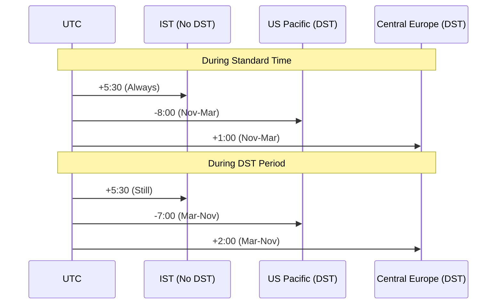

# DST Effects on Timezone Conversion

## DST Overview

While IST (UTC+5:30) doesn't observe DST, many other timezones do. This creates varying time differences throughout the year when scheduling notifications across different regions.

## Example with Multiple Timezones



## DST Transition Examples

### Example 1: US Pacific Time (Observes DST)
```php
// Standard Time (November - March)
UTC 10:00 AM → PST 2:00 AM (-8 hours)
IST 3:30 PM → PST 2:00 AM (-13:30 hours)

// During DST (March - November)
UTC 10:00 AM → PDT 3:00 AM (-7 hours)
IST 3:30 PM → PDT 3:00 AM (-12:30 hours)
```

### Example 2: Central European Time (Observes DST)
```php
// Standard Time (November - March)
UTC 10:00 AM → CET 11:00 AM (+1 hour)
IST 3:30 PM → CET 11:00 AM (-4:30 hours)

// During DST (March - November)
UTC 10:00 AM → CEST 12:00 PM (+2 hours)
IST 3:30 PM → CEST 12:00 PM (-3:30 hours)
```

## Handling DST in Code

```php
// Example showing DST-aware timezone conversion
function getTimezoneOffset($timezone, $date) {
    $tz = new \DateTimeZone($timezone);
    $dateTime = new \DateTimeImmutable($date, new \DateTimeZone('UTC'));
    $offset = $tz->getOffset($dateTime);
    
    $hours = floor(abs($offset) / 3600);
    $minutes = floor((abs($offset) % 3600) / 60);
    
    return sprintf(
        "%s%02d:%02d",
        $offset >= 0 ? '+' : '-',
        $hours,
        $minutes
    );
}

// Usage example
$date = "2024-01-01 10:00:00"; // Winter
echo "PST Offset (Winter): " . getTimezoneOffset('America/Los_Angeles', $date);  // -08:00

$date = "2024-07-01 10:00:00"; // Summer
echo "PDT Offset (Summer): " . getTimezoneOffset('America/Los_Angeles', $date);  // -07:00

// IST remains constant
echo "IST Offset (Always): " . getTimezoneOffset('Asia/Kolkata', $date);  // +05:30
```

## Important DST Considerations

1. **DST Transitions**
   - Spring forward: Clocks move ahead 1 hour
   - Fall back: Clocks move back 1 hour
   - IST remains unaffected

2. **DST Impact on Scheduling**
   ```php
   // Example: Scheduling across DST transition
   $scheduledTime = new \DateTimeImmutable(
       "2024-03-10 02:30:00",
       new \DateTimeZone('America/Los_Angeles')
   );
   // This time doesn't exist during Spring forward!
   ```

3. **Edge Cases**
   - Non-existent times during Spring forward
   - Repeated times during Fall back
   - Scheduling around DST transitions needs special handling

4. **Best Practices**
   ```php
   // Always use DateTimeImmutable for DST-aware operations
   $dateTime = new \DateTimeImmutable($timeString, new \DateTimeZone($userTimezone));
   
   // Check if time exists (for DST transitions)
   if ($dateTime->format('I') !== $dateTime->modify('+1 second')->format('I')) {
       // We're at a DST transition point
       // Handle accordingly
   }
   ```

## DST Transition Handling

```php
public function isInDSTTransition($dateTime, $timezone) {
    $tz = new \DateTimeZone($timezone);
    $transitions = $tz->getTransitions(
        $dateTime->getTimestamp(),
        $dateTime->getTimestamp()
    );
    
    return count($transitions) > 0;
}

// Example usage in notification scheduling
if (isInDSTTransition($scheduleTime, $userTimezone)) {
    // Handle DST transition case
    // Maybe adjust time or notify user
    $this->logger->warning('Scheduled time falls during DST transition');
}
```

This code checks for and handles DST transitions, ensuring notifications are delivered at the correct time even during timezone changes.
