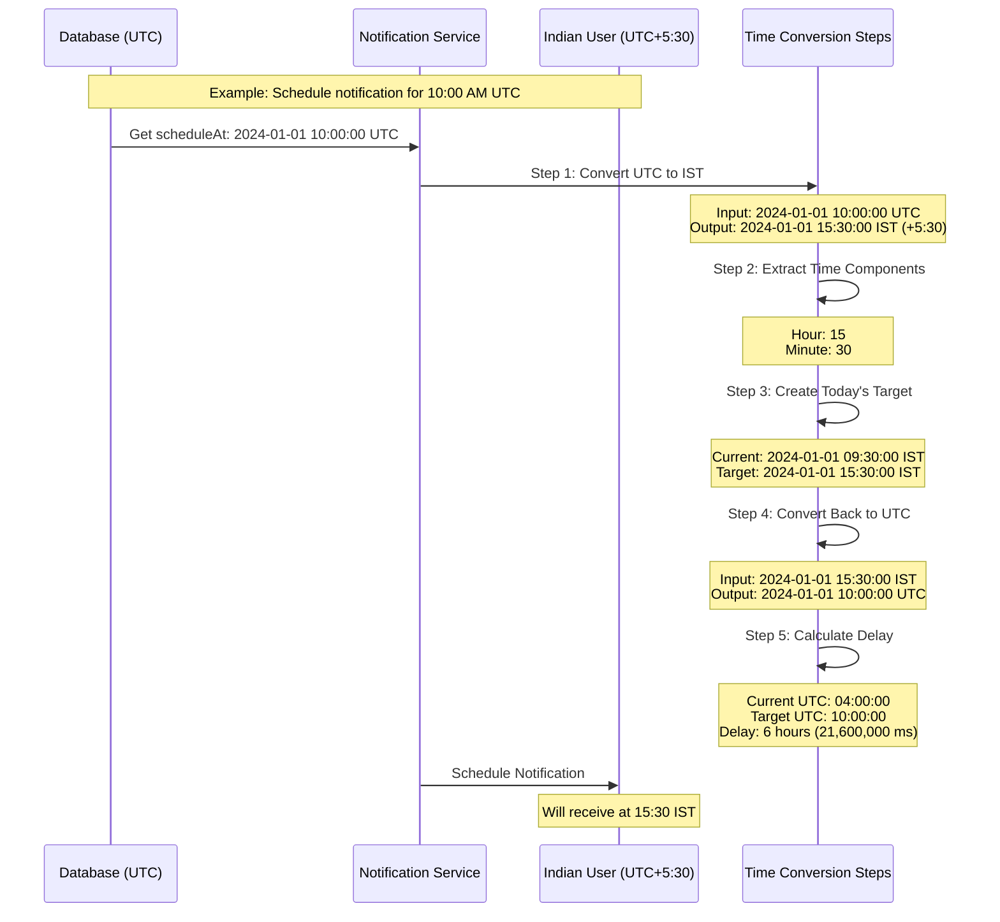

# Timezone Conversion Process - IST and UTC

This document explains the timezone conversion process between UTC and IST (Indian Standard Time) in the notification system.

## Overview

The system converts times between UTC (Coordinated Universal Time) and IST (Indian Standard Time, UTC+5:30) to ensure notifications are delivered at the correct local time for Indian users.

## Process Flow Diagram



## Time Conversion Examples

### Example 1: Morning Notification
- UTC Time: 04:00:00 (4:00 AM UTC)
- IST Time: 09:30:00 (9:30 AM IST)
- Conversion: Add 5 hours and 30 minutes to UTC

### Example 2: Afternoon Notification
- UTC Time: 10:00:00 (10:00 AM UTC)
- IST Time: 15:30:00 (3:30 PM IST)
- Conversion: Add 5 hours and 30 minutes to UTC

### Example 3: Evening Notification
- UTC Time: 14:00:00 (2:00 PM UTC)
- IST Time: 19:30:00 (7:30 PM IST)
- Conversion: Add 5 hours and 30 minutes to UTC

## Detailed Step-by-Step Process

### 1. Convert UTC to IST
```php
Input: 2024-01-01 10:00:00 UTC
Code:
$scheduleTimeUTC = new \DateTimeImmutable("2024-01-01 10:00:00", new \DateTimeZone('UTC'));
$userTz = new \DateTimeZone('Asia/Kolkata');
$userLocalScheduleTime = $scheduleTimeUTC->setTimezone($userTz);
Output: 2024-01-01 15:30:00 IST  // UTC+5:30
```

### 2. Extract Hour and Minute
```php
Input: 2024-01-01 15:30:00 IST
Code:
$targetHour = (int)$userLocalScheduleTime->format('H');    // 15
$targetMinute = (int)$userLocalScheduleTime->format('i');  // 30
Output: Hour = 15, Minute = 30
```

### 3. Create Today's Target Time
```php
Current: 2024-01-01 09:30:00 IST
Code:
$userTargetTime = new \DateTimeImmutable(
    $userCurrentTime->format('Y-m-d') . ' ' . 
    sprintf('%02d:%02d:00', $targetHour, $targetMinute),
    $userTz
);
Output: 2024-01-01 15:30:00 IST
```

### 4. Convert Back to UTC
```php
Input: 2024-01-01 15:30:00 IST
Code:
$utcTargetTime = $userTargetTime->setTimezone(new \DateTimeZone('UTC'));
Output: 2024-01-01 10:00:00 UTC  // IST-5:30
```

### 5. Calculate Delay
```php
Current UTC: 04:00:00
Target UTC: 10:00:00
Code:
$delay = ($utcTargetTime->getTimestamp() - $now->getTimestamp()) * 1000;
Result: 21,600,000 milliseconds (6 hours)
```

## Complete Implementation Example

```php
// Initial notification time (10:00 AM UTC)
$scheduleTimeUTC = new \DateTimeImmutable("2024-01-01 10:00:00", new \DateTimeZone('UTC'));

// Convert to IST (3:30 PM IST)
$indianTz = new \DateTimeZone('Asia/Kolkata');
$indianTime = $scheduleTimeUTC->setTimezone($indianTz);

// Extract time components
$targetHour = (int)$indianTime->format('H');     // 15
$targetMinute = (int)$indianTime->format('i');   // 30

// Create target time for today
$currentTimeIST = new \DateTimeImmutable('now', $indianTz);
$targetTimeIST = new \DateTimeImmutable(
    $currentTimeIST->format('Y-m-d') . ' ' . 
    sprintf('%02d:%02d:00', $targetHour, $targetMinute),
    $indianTz
);

// Convert back to UTC
$targetTimeUTC = $targetTimeIST->setTimezone(new \DateTimeZone('UTC'));

// Calculate delay
$now = new \DateTimeImmutable('now', new \DateTimeZone('UTC'));
$delayInMilliseconds = ($targetTimeUTC->getTimestamp() - $now->getTimestamp()) * 1000;
```

## Time Conversion Table

| Event | UTC Time | IST Time | Conversion |
|-------|----------|----------|------------|
| Current Time | 04:00:00 | 09:30:00 | UTC + 5:30 |
| Target Time | 10:00:00 | 15:30:00 | UTC + 5:30 |
| Delay | 6 hours | 6 hours | Same |

## Important Notes for IST

1. **Fixed Offset**
   - IST is always UTC+5:30
   - No daylight saving time adjustments
   - The 30-minute offset is unique to IST

2. **Conversion Rules**
   - To get IST: Add 5 hours and 30 minutes to UTC
   - To get UTC: Subtract 5 hours and 30 minutes from IST

3. **Common Times**
   - IST business hours (9:30 AM - 6:00 PM) correspond to:
   - UTC: 4:00 AM - 12:30 PM

4. **Best Practices**
   - Always use 'Asia/Kolkata' as timezone identifier
   - Account for the 30-minute offset in calculations
   - Use DateTime classes for automatic handling

## Troubleshooting

Common issues specific to IST:
- Incorrect timezone string (use 'Asia/Kolkata', not 'IST')
- Manual calculations not accounting for 30-minute offset
- Date boundary issues when converting UTC to IST
- Edge cases around midnight UTC (affects date in IST)

The system includes detailed logging for tracking timezone conversions:
