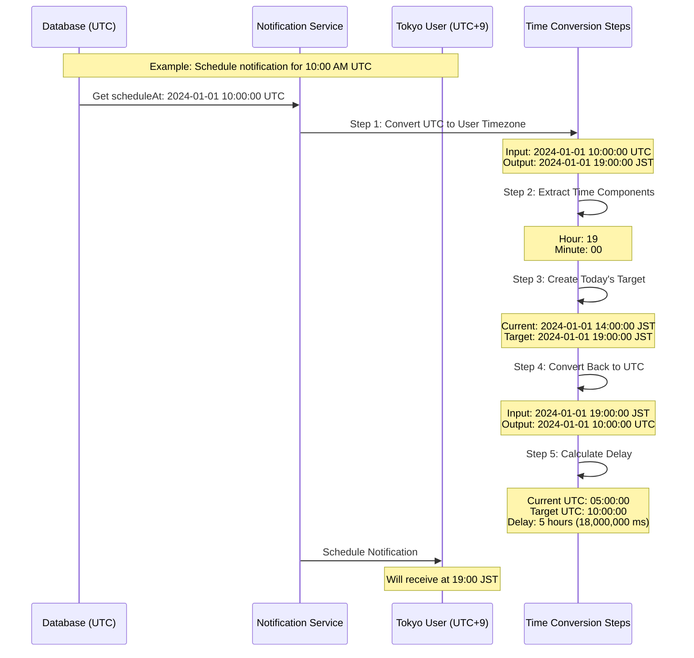

# Timezone Conversion Process for Notifications

This document explains the timezone conversion process used in the notification system to ensure notifications are delivered at the correct local time for each user.

## Overview

The system handles timezone conversions to ensure that notifications are delivered at the appropriate local time for each user, regardless of their timezone. All times are stored in UTC in the database and converted as needed.

## Process Flow Diagram



## Initial Conditions

- Notification time in database: `2024-01-01 10:00:00 UTC`
- Current time: `2024-01-01 05:00:00 UTC`
- Example user timezone: Tokyo (UTC+9)

## Detailed Step-by-Step Process

### 1. Convert UTC to User Timezone
```php
Input: 2024-01-01 10:00:00 UTC
Output: 2024-01-01 19:00:00 JST
```
- Takes the UTC time from database
- Converts it to user's local timezone (Tokyo/JST)
- Accounts for timezone offset (+9 hours for Tokyo)

### 2. Extract Hour and Minute
```php
Input: 2024-01-01 19:00:00 JST
Output: Hour = 19, Minute = 00
```
- Extracts the time components from the local time
- These components represent the desired notification time in user's timezone

### 3. Create Today's Target Time
```php
Current time in JST: 2024-01-01 14:00:00 JST
Created target: 2024-01-01 19:00:00 JST
```
- Takes current date in user's timezone
- Combines it with extracted hour/minute
- Creates a new timestamp for today with the desired notification time

### 4. Convert Back to UTC
```php
Input: 2024-01-01 19:00:00 JST
Output: 2024-01-01 10:00:00 UTC
```
- Converts the target time back to UTC
- This time is used for scheduling in the message queue

### 5. Calculate Delay
```php
Current UTC: 2024-01-01 05:00:00
Target UTC: 2024-01-01 10:00:00
Calculation: (10:00:00 - 05:00:00) * 1000
Result: 18,000,000 milliseconds (5 hours)
```
- Calculates the delay between current UTC time and target UTC time
- Converts the delay to milliseconds for the message queue

## Example Timeline

Using Tokyo (UTC+9) as an example:
1. **Database Time**: 10:00 UTC
2. **User's Local Time**: 19:00 JST
3. **Current Time**: 05:00 UTC (14:00 JST)
4. **Delay**: 5 hours (until 10:00 UTC / 19:00 JST)

## Implementation Example

```php
// Create notification schedule time in UTC
$scheduleTimeUTC = new \DateTimeImmutable("2024-01-01 10:00:00", new \DateTimeZone('UTC'));

// Convert to user's timezone (Tokyo)
$userTz = new \DateTimeZone('Asia/Tokyo');
$userLocalScheduleTime = $scheduleTimeUTC->setTimezone($userTz);
// Result: 2024-01-01 19:00:00 JST

// Extract time components
$targetHour = 19;    // from $userLocalScheduleTime->format('H')
$targetMinute = 00;  // from $userLocalScheduleTime->format('i')

// Create today's target time
$userTargetTime = new \DateTimeImmutable(
    "2024-01-01 19:00:00",
    new \DateTimeZone('Asia/Tokyo')
);

// Convert back to UTC
$utcTargetTime = $userTargetTime->setTimezone(new \DateTimeZone('UTC'));
// Result: 2024-01-01 10:00:00 UTC

// Calculate delay
$delayInMilliseconds = (10 hours - 5 hours) * 3600 * 1000;
// Result: 18,000,000 milliseconds
```

## Important Notes

- All database times are stored in UTC
- The system handles daylight saving time automatically through PHP's DateTime class
- Delays are always calculated in UTC to avoid timezone-related issues
- The process ensures notifications are delivered at the correct local time regardless of:
  - When the scheduler runs
  - User's timezone
  - Daylight saving time changes

## Troubleshooting

Common issues to watch for:
- Incorrect timezone strings
- Missing timezone information in user profiles
- Daylight saving time transition periods
- Invalid datetime formats

The system includes extensive logging to track each step of the conversion process for debugging purposes.
